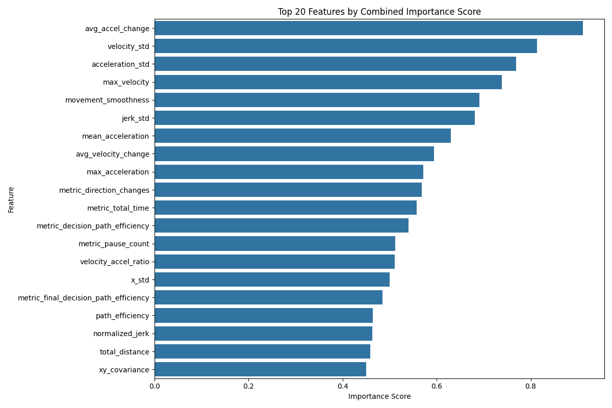
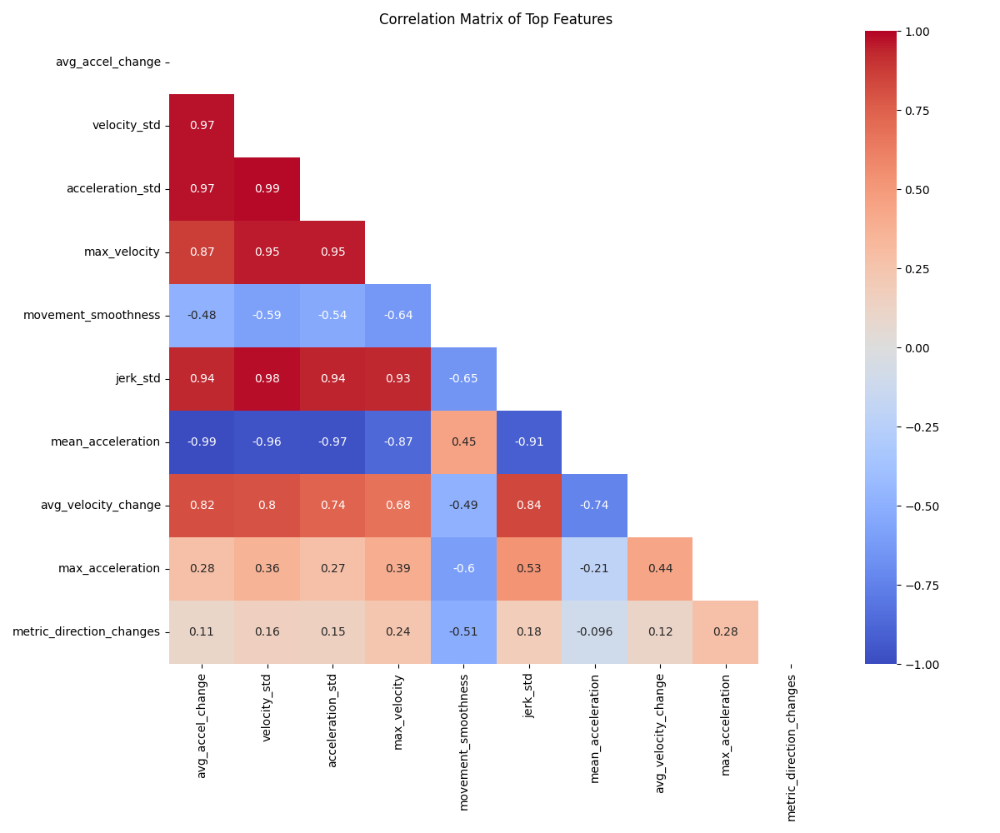
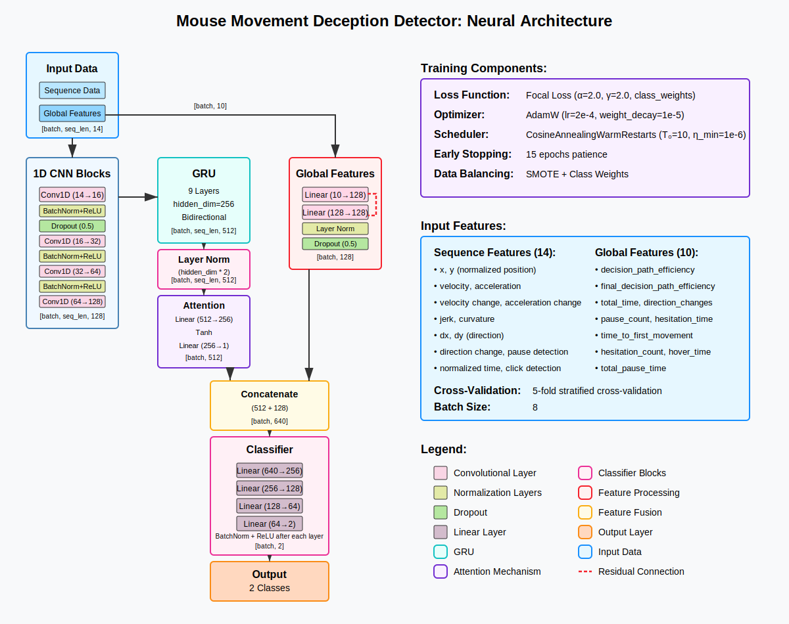

# Mouse Tracking Deception Detection Playground

A research playground for exploring mouse tracking as a method for deception detection, including data collection, feature extraction, and neural network classification.

## Overview

This repository contains a complete mouse tracking experiment framework including:
- A Flask-based web application for data collection
- Data preprocessing scripts
- Feature importance analysis
- Neural network training and visualization for deception detection

## Features

- **Dynamic Layout System**: 5 unique, responsive CSS layouts
- **Mouse Tracking**: Captures detailed mouse movement and interaction data
- **Experimental Design**:
    - Truthful vs. Deceptive response tracking
    - Location-based questioning with randomized question selection
    - Randomized yes/no button placement
    - Comprehensive data logging
- **Data Analysis**:
    - Feature importance extraction
    - Trajectory preprocessing
    - Neural network classification (best model: 68.57% accuracy on test set)

## Project Structure

The repository contains multiple data collections and processing results:

```
.
├── data_new/                               # Newer data collection
├── data_new_truncated/                     # Truncated newer data
├── data_new_truncated_final/               # Final truncated dataset
├── feature_analysis/                       # Feature visualization plots
├── *_graphs/                               # Various graph collections
├── images/                                 # Layout and visualization images
├── logs_*/                                 # Different model training logs (GRU, LSTM, SMOTE variants)
├── static/                                 # Static web assets
├── templates/                              # HTML templates
├── app.py                                  # Flask web application
├── architecture.svg                        # Neural network architecture diagram
├── confusion_matrix.png                    # Confusion matrix visualization
├── Consent Form for Data Collection.pdf    # Data collection consent form
├── convert.py                              # Data conversion utility
├── display.py                              # Data visualization tool
├── feature_importance.csv                  # CSV of feature importance scores
├── feature_analysis.py                     # Feature importance analysis
├── network_visualization.png               # Network visualization image
├── README.md                               # Project documentation
├── sample.json                             # Sample data format
├── top_features_importance.png             # Top features visualization
├── train.py                                # Base training script
├── train_GRU.py                            # GRU model training script
├── train_LSTM.py                           # LSTM model training script
├── train_optim_GRU_SMOTE.py                # Optimized GRU with SMOTE copy
├── train_optim_GRU_SMOTE_v3.py             # Optimized GRU with SMOTE v3
├── truncate.py                             # Trajectory preprocessing
└── truncate_ext.py                         # Extended trajectory preprocessing
```

## Layouts Showcase

The application randomly selects from 5 unique layouts for each experiment session:

| Layout   | Preview                           | Description                         |
|----------|-----------------------------------|-------------------------------------|
| Layout 1 |  | Vertical, clean modern design       |
| Layout 2 |  | Horizontal, split-screen approach   |
| Layout 3 |  | Innovative corner-positioned layout |
| Layout 4 |  | Modern diagonal layout              |
| Layout 5 |  | Fully responsive clean layout       |

## Key Components

### Data Collection (`app.py`, `script.js`)
- Manages experiment flow
- Randomizes question selection for each phase
- Swaps yes/no button positions randomly
- Logs detailed mouse tracking data
- Supports truthful and deceptive response phases

## Data Preprocessing
- **`truncate.py`**: Trims trajectory data after the last click event
- **`truncate_ext.py`**: Extended preprocessing that also removes initial points where both x and y are 0
- Multiple preprocessing approaches resulted in various dataset versions:
    - `data_new`: Newest data collection
    - `*_truncated`: Trajectories trimmed after last click
    - `*_truncated_final`: Final version with optimized preprocessing

### Feature Analysis


- **`feature_analysis.py`**: Analyzes feature importance for deception detection
- Most discriminative features include:
    - Acceleration changes
    - Velocity standard deviation
    - Movement smoothness
    - Jerk metrics

## Neural Network


- Best model performance: 68.57% accuracy on test set
- Better network performance noted when using preprocessed data with `truncate.py` or `truncate_ext.py`
- Multiple model variants explored (GRU, LSTM, optimized versions with SMOTE)

## Model Training Approaches

The repository includes several training approaches to ensure robust evaluation:

1. **Basic Training** (`train.py`, `train_GRU.py`, `train_LSTM.py`)
    - Standard train/validation/test split
    - Focuses on different network architectures (standard, GRU, LSTM)

2. **Cross-Validation** (`train_optim_GRU_SMOTE.py`, `train_optim_GRU_SMOTE_v3.py`)
    - Implements StratifiedKFold cross-validation (5 folds)
    - Stratification ensures each fold maintains the same class distribution as the original dataset
    - This is critical for imbalanced datasets to prevent training or testing on skewed class distributions
    - Each fold trains on 80% of data and tests on 20% while preserving class ratios
    - The best-performing fold is selected as the final model
    - Provides a more reliable model selection approach compared to a single train/test split

3. **SMOTE-Enhanced Training**
    - Addresses class imbalance using Synthetic Minority Oversampling Technique
    - Creates synthetic samples of the minority class
    - Improves model's ability to detect deceptive movements

All approaches employ early stopping, learning rate scheduling, and focal loss to handle class imbalance.

## Tracked Metrics

The system captures a comprehensive set of mouse movement features:
- Trajectory coordinates (x, y)
- Velocity and acceleration
- Curvature and jerk
- Path efficiency
- Hesitations and pauses
- Directional changes
- Decision timing

## Setup and Installation

1. **Clone the repository**
   ```bash
   git clone <repository-url>
   cd mouse-tracking-playground
   ```

2. **Create virtual environment**
   ```bash
   python -m venv .venv
   source .venv/bin/activate  # On Windows: .venv\Scripts\activate
   ```

3. **Install dependencies**
   ```bash
   pip install flask pandas numpy matplotlib scikit-learn tqdm seaborn torch imblearn
   ```

4. **Run the web application for data collection**
   ```bash
   python app.py
   ```

5. **Visualize data and model results**
   ```bash
   python display.py
   ```

## Experiment Workflow

1. **Data Collection**
    - Run the Flask application
    - Collect participant responses through the web interface
    - Data is automatically saved to the data folders

2. **Data Preprocessing**
   ```bash
   python truncate_ext.py  # Or truncate.py for basic preprocessing
   ```

3. **Feature Importance Analysis**
   ```bash
   python feature_analysis.py
   ```

4. **Model Training**
    - Train different neural networks (GRU, LSTM) on the preprocessed data:
      ```bash
      python train_GRU.py  # Standard GRU training
      python train_LSTM.py  # LSTM variant
      ```
    - Train with k-fold cross-validation and SMOTE class balancing:
      ```bash
      python train_optim_GRU_SMOTE_v3.py  # 5-fold CV with SMOTE
      ```
    - Best results achieved with truncated trajectory data and cross-validated models

## Research Findings

- Movement dynamics (acceleration change, velocity std) are the most discriminative features
- Path efficiency and movement smoothness show significant differences between truthful and deceptive responses
- Multiple models explored:
    - GRU-based models with various optimization strategies (v1-v6)
    - LSTM models
    - SMOTE (Synthetic Minority Oversampling Technique) for handling class imbalance
- Best model achieved 68.57% accuracy on the test set
- StratifiedKFold cross-validation (5 folds) was used to maintain class distribution across all data splits
- The best-performing fold was selected as the final model
- Visualization outputs stored in various graph folders

## Technologies Used

- **Backend**: Flask
- **Frontend**: HTML, CSS, JavaScript
- **Data Analysis**:
    - Pandas
    - NumPy
    - Matplotlib
    - Seaborn
- **Machine Learning**:
    - PyTorch (neural network implementation)
    - Scikit-learn (metrics and preprocessing)
    - Imbalanced-learn (SMOTE for class balancing)
